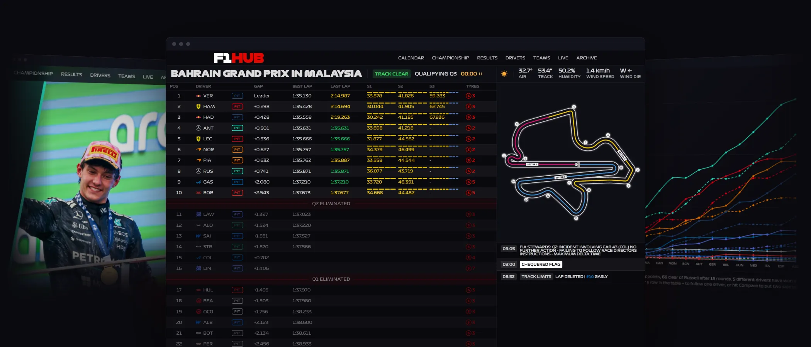
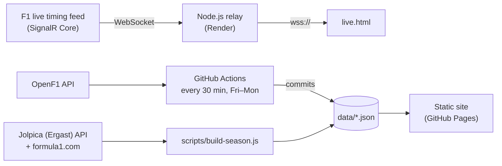

# F1 Hub

Every Grand Prix in one place: live timing during sessions, the calendar in your local time, full results and standings, driver and team profiles, and an archive of every season since 1990.

**[Live site ↗](https://benipach.github.io/f1-hub-project)**



---

## Highlights

**Live timing relay (Node.js).** `server/client.js` connects to Formula 1's official live timing feed the same way formula1.com does: SignalR Core over a raw WebSocket. It subscribes to 11 topics (timing, tyres, car positions, track status, race control, weather…), inflates the compressed ones with zlib, merges each delta into a local state and rebroadcasts it to every connected browser. It runs on Render, so the site works from any device without a machine at home staying on.

- **Results stay up after the chequered flag.** Once a session ends, the relay keeps its final classification visible for 24 hours, or until the next session goes live.
- **Correct finishing laps.** The relay decides when each driver has finished using the feed's own timestamps. That matters because the flag message can arrive *after* the leader's crossing. It does this server-side because the relay is always connected, so it sees every crossing even when nobody has the page open.
- **Estimated car positions.** The public feed doesn't include car GPS positions (only F1 TV accounts get them), so the track map places each car from mini-sector timing: it knows the last checkpoint each car passed (~25 per lap) and moves it at the pace of its last lap until the next one.
- **TV sync.** The page can delay incoming data by a few seconds so it doesn't spoil an overtake before the broadcast shows it.

**Automated results pipeline (GitHub Actions).** A scheduled workflow runs every 30 minutes from Friday to Monday. It first checks whether any session ended at least 45 minutes ago and is still missing results or weather, so it does nothing on most runs. When there's work to do, it pulls the data from the OpenF1 API, rebuilds the precomputed career stats and commits the result. The site updates itself after every session.

**Historical archive (1990–2026).** `scripts/build-season.js` builds a full season file from the Jolpica (Ergast) API, plus practice sessions scraped from formula1.com. Together the season files weigh several MB, so the pages that need data across seasons read precomputed indexes (`careers.json`, `seasons-index.json`) instead, with a single small request.

**No framework, no build step.** Vanilla HTML, CSS and JavaScript served from GitHub Pages, with Chart.js for the charts.

## Architecture



## Pages

| Page | File | What it shows |
|---|---|---|
| Home | `index.html` | Countdown to the next session, weekend schedule in your local time, season calendar and standings |
| Live | `live.html` | Live classification, sectors, tyres, track map with estimated car positions, race control messages and weather |
| Grand Prix | `grandsprix/grandprix.html?gp=<id>` | Session results, circuit details, weather and past winners |
| Drivers | `drivers.html` · `drivers/driver.html?driver=<id>` | Driver grid and profiles with season stats, charts and career history |
| Teams | `teams.html` · `teams/team.html?team=<id>` | Team grid and profiles with season stats, lineage and constructor history |
| Results | `results.html?season=<year>` | Any season in one page: the season in numbers, driver and constructor standings with cumulative points charts, and every session with each row expanding into the full classification |

## Tech stack

- **Frontend:** HTML, CSS, vanilla JavaScript, [Chart.js](https://www.chartjs.org/) (with chartjs-plugin-zoom and Hammer.js for zoom and pan), Twemoji
- **Relay:** Node.js, [`@microsoft/signalr`](https://www.npmjs.com/package/@microsoft/signalr), [`ws`](https://www.npmjs.com/package/ws), deployed on [Render](https://render.com/) (`render.yaml`)
- **Data:** JSON files under `data/`, updated by GitHub Actions and Node.js scripts
- **Sources:** F1 live timing, [OpenF1](https://openf1.org/), [Jolpica-F1](https://github.com/jolpica/jolpica-f1) (Ergast-compatible), formula1.com

## Project structure

```text
├── index.html, live.html, …        # One HTML file per page (see Pages)
├── drivers/, teams/, grandsprix/   # Profile and Grand Prix templates, routed by query string
├── js/
│   ├── pages/                      # Page scripts
│   ├── shared/                     # Data loading, formatting and team helpers shared across pages
│   └── live.js                     # Live timing client
├── styles/                         # One stylesheet per page + global styles
├── server/                         # Live timing relay (Node.js)
├── scripts/                        # Season builders and precomputed indexes
├── auto-fill-missing.js            # Fills finished sessions from OpenF1 (run by GitHub Actions)
├── data/
│   ├── seasons/season{year}.json   # One file per season, 1990–2026
│   ├── careers.json                # Precomputed career stats
│   └── seasons-index.json          # Precomputed season summaries
└── .github/workflows/              # Scheduled results update
```

## Running locally

The site fetches its data as JSON, so it needs to be served over HTTP rather than opened as a file:

```bash
npx serve .
```

To run the live timing relay:

```bash
cd server
npm install
npm start        # ws://localhost:8080, health check at http://localhost:8080/health
```

Then open `live.html?relay=ws://localhost:8080`. The page remembers that relay on this device; open `live.html?relay=` to go back to the default.

To work on the live page without a live session, replay a past one from F1's archive (from `server/`):

```bash
node replay/download.js 2026                    # list the season's sessions
node replay/download.js 2026 bahrain race       # download one (~20 MB, not committed)
node client.js --replay replay/sessions/2026/2026-10-04_Bahrain_Grand_Prix/2026-10-04_Race --from start
```

Playback starts when the page connects, with every timestamp moved to the present so the clocks behave as if the session were live. `--from 01:20:00` skips to a point of the recording, `--from start` to a minute before the green flag, and `--speed 4` plays faster. `node replay/ws-stats.js ws://localhost:8080 120` measures what the relay sends to each page.

To rebuild data (from the repo root, after `npm install`):

```bash
node scripts/build-season.js 2025      # Build or complete a season file
node scripts/build-careers.js          # Regenerate careers.json
node scripts/build-seasons-index.js    # Regenerate seasons-index.json
```

---

> Unofficial fan project. Not affiliated with Formula 1, FOM or the FIA.
